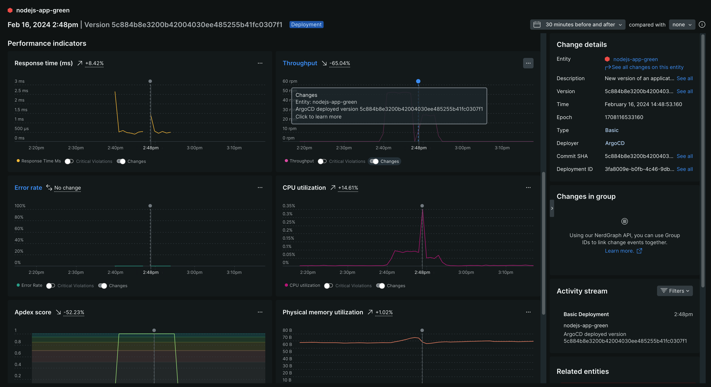

<a href="https://opensource.newrelic.com/oss-category/#new-relic-experimental"><picture><source media="(prefers-color-scheme: dark)" srcset="https://github.com/newrelic/opensource-website/raw/main/src/images/categories/dark/Experimental.png"><source media="(prefers-color-scheme: light)" srcset="https://github.com/newrelic/opensource-website/raw/main/src/images/categories/Experimental.png"></picture></a>

# New Relic ArgoCD Notification Webhook


>This project contains example YAML for enabling [ArgoCD Notifications](https://argocd-notifications.readthedocs.io/en/stable/) as [New Relic Change Tracking](https://docs.newrelic.com/docs/change-tracking/change-tracking-graphql/) events.

## Value

|Metrics | Events | Logs | Traces | Visualization | Automation |
|:-:|:-:|:-:|:-:|:-:|:-:|
|:x:|:white_check_mark:|:x:|:x:|:x:|:white_check_mark:|

## Installation

1. Define your New Relic User API Key in your `argocd-notifications-secret` Secret.  

An example can be found [here](./argocd-notifications-secret.yaml).

```yaml
...
stringData:
  newrelic-apiKey: NRAK-YOURAPIKEYGOESHERE
...
```

2. Add the New Relic `trigger`, `template`, and `service` to your `argocd-notifications-cm` ConfigMap.  

The default catalog can be found [here](https://raw.githubusercontent.com/argoproj/argo-cd/master/notifications_catalog/install.yaml).

```yaml
...
trigger.app-deployed: |
  - description: Application is synced and healthy. Triggered once per commit.
  oncePer: app.status.sync.revision
  send:
   - newrelic-app-deployed
  when: app.status.operationState.phase in ['Succeeded'] and app.status.health.status == 'Healthy'
template.newrelic-app-deployed: |
  webhook:
    newrelic:
      method: POST
      body: |
        mutation {
          changeTrackingCreateDeployment(
            deployment: { 
            version: "{{.app.status.sync.revision}}",
            entityGuid: "{{.app.metadata.annotations.entityguid}}",
            commit: "{{.app.status.sync.revision}}",
            user: "ArgoCD",
            deploymentType: BASIC,
            description: "New version of an application {{.app.metadata.name}} has been deployed."
            }
          ) {
            deploymentId
             entityGuid
          }
        }
service.webhook.newrelic: |
  url: https://api.newrelic.com/graphql
  headers:
  - name: Content-Type
    value: application/graphql
  - name: Api-Key
    value: $newrelic-apiKey
...
```

3. Apply the changes to your ArgoCD instance.

```yaml
kubectl apply -f argocd-notifications-secret.yaml -n argocd
kubectl apply -f argocd-notifications-cm.yaml -n argocd
```

## Configuring your ArgoCD Applications

An ArgoCD Application needs to "subscribe" to notifications so you'll need to add the following annotations to your ArgoCD Application.

Check out the example application [here](./argocd-application/notification-demo.yaml).

```yaml
...
annotations:
  notifications.argoproj.io/subscribe.newrelic-app-deployed.newrelic: ""
  entityguid: "<NEW RELIC ENTITY GUID>"  
...
```

`entityguid` is the New Relic entity guid for the APM application.  You'll need to perform an initial deployment of your app in order to generate an entity guid in the New Relic platform.  Subsequent deployments can then be associated with this guid.


## New Relic Change Tracking

After the ArgoCD deployment process completes, you should see the change tracking event and the before and after state of the application in New Relic.




## Support

New Relic has open-sourced this project. This project is provided AS-IS WITHOUT WARRANTY OR DEDICATED SUPPORT. Issues and contributions should be reported to the project here on GitHub.

>We encourage you to bring your experiences and questions to the [Explorers Hub](https://discuss.newrelic.com) where our community members collaborate on solutions and new ideas.


## Contributing

We encourage your contributions to improve the New Relic ArgoCD Notification Webhook! Keep in mind when you submit your pull request, you'll need to sign the CLA via the click-through using CLA-Assistant. You only have to sign the CLA one time per project. If you have any questions, or to execute our corporate CLA, required if your contribution is on behalf of a company, please drop us an email at opensource@newrelic.com.

**A note about vulnerabilities**

As noted in our [security policy](../../security/policy), New Relic is committed to the privacy and security of our customers and their data. We believe that providing coordinated disclosure by security researchers and engaging with the security community are important means to achieve our security goals.

If you believe you have found a security vulnerability in this project or any of New Relic's products or websites, we welcome and greatly appreciate you reporting it to New Relic through [HackerOne](https://hackerone.com/newrelic).

## License

The New Relic ArgoCD Notification Webhook is licensed under the [Apache 2.0](http://apache.org/licenses/LICENSE-2.0.txt) License.

